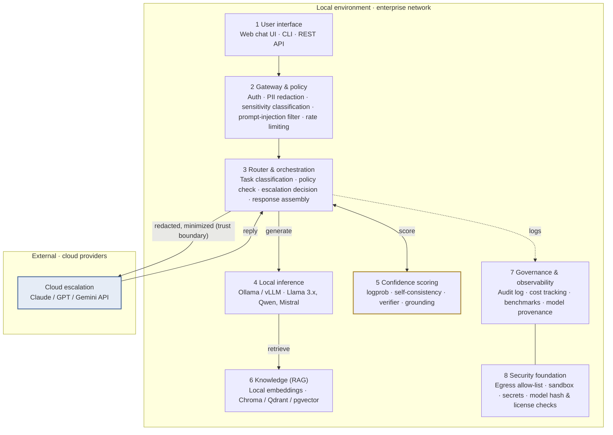
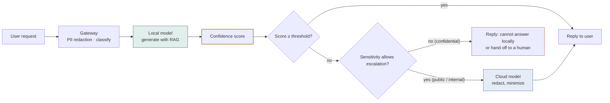
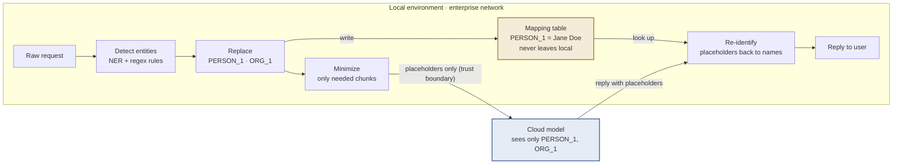

# Hybrid AI Assistant Architecture Draft

**Capstone · Virtual Gold Inc · Week 3 · Scope & Project Charter**

A local-first enterprise AI assistant: open-source models are the primary intelligence layer, and requests escalate to cloud models only when confidence scores and data sensitivity allow.

| Version | Date | Status | Client contact |
|---|---|---|---|
| v0.1 draft | 2026-09-07 | For client review | Urte Jesina |

---

## 1. Problem and objective

Organizations want to deploy AI assistants but struggle to balance data privacy, security, cost, model reliability, and vendor dependence. Open-source models offer control and privacy but may fall short on complex tasks. Cloud models are more capable but raise compliance, security, and cost concerns.

This project designs and evaluates a hybrid architecture: **local open-source models act as the primary intelligence layer**, every response gets a **measured confidence score**, and requests are **escalated to cloud models only when necessary**, keeping sensitive data local whenever possible.

## 2. Design principles

| Principle | Meaning |
|---|---|
| **Local first** | Every request is handled by a local model by default. The cloud is an escalation path, not the default path. |
| **Data classification decides routing** | Confidential data never leaves the local environment, regardless of how low local confidence is. |
| **Escalation must be justified** | Every escalation can state its reason: score, task type, budget. All of it is logged. |
| **Replaceable components** | Models, vector stores, and cloud providers plug in through abstract interfaces to avoid vendor lock-in. |

## 3. System layers

There is exactly one place where the system crosses the trust boundary: the routing layer sends redacted, minimized content to the cloud. Every other layer runs inside the enterprise network.

**Figure 1.** Everything inside the local box runs in the enterprise environment. The only channel crossing the trust boundary carries redacted content from the router to the cloud and the reply back. The confidence scoring module is the research core of this project. See Figure 3 for the detail of this channel.

| # | Layer | Responsibilities |
|---|---|---|
| 1 | User interface | Web chat UI, CLI, REST API |
| 2 | Gateway & policy | Auth, PII detection & redaction, sensitivity classification, prompt-injection filter, rate limiting |
| 3 | Router & orchestration | Task classification, policy check, escalation decision, response assembly |
| 4 | Local inference | Ollama / vLLM; Llama 3.x, Qwen, Mistral |
| 5 | Confidence scoring | logprob, self-consistency, verifier model, retrieval grounding |
| 6 | Knowledge (RAG) | Local embeddings; Chroma / Qdrant / pgvector |
| 7 | Governance & observability | Audit log, cost tracking, benchmarks, model provenance |
| 8 | Security foundation | Egress allow-list, sandbox, secrets management, model hash & license checks |
| — | Cloud escalation (external) | Claude / GPT / Gemini API; receives only redacted, minimized content |

## 4. Core request flow

A request passes three decision points on its way to a reply: sensitivity classification, the confidence threshold, and whether escalation is permitted. All three outcomes are written to the audit log.

**Figure 2.** The confidence score decides whether escalation is needed; the sensitivity class decides whether escalation is allowed. When both fail, the system admits uncertainty rather than sending confidential data out.

Step by step:

1. The gateway authenticates the user, scans for PII, and tags the request as public, internal, or confidential.
2. The router classifies the task (Q&A, summary, code, reasoning) and retrieves relevant documents through RAG.
3. The local model generates a response and the confidence module scores it.
4. If the score meets the threshold, the response is returned directly.
5. If the score is below the threshold and the sensitivity class permits, the content is redacted and minimized, then sent to a cloud model.
6. If the class is confidential, the request is never sent out. The system replies that it cannot answer locally or hands off to a human.
7. Every decision, score, cost, and latency is written to the audit log for later evaluation.

## 5. Confidence scoring: the research core

The client proposal's "measure confidence in generated responses" is the technical highlight of this project. We recommend building it as a standalone module that supports several strategies, then comparing them in the benchmark. The midpoint presentation can show the trade-offs across three dimensions: escalation rate, answer quality, and cost.

| Strategy | How it works | Extra cost | Accuracy tendency | Best for |
|---|---|---|---|---|
| Token probability | Mean logprob or entropy, taken directly from model output | Near zero | Moderate; prone to overconfidence | Baseline for the MVP |
| Self-consistency | Sample the same question N times and check agreement | Latency × N | Better | Q&A and calculations with a definite answer |
| Verifier model | A small local model acts as judge and grades the response | One extra small inference | Good, but depends on judge quality | Open-ended generation, summaries |
| Retrieval grounding | Whether the response is supported by retrieved RAG documents | Low | Very good for knowledge Q&A | Internal knowledge-base questions |
| Task heuristics | Decide by task type, e.g. multi-step reasoning escalates by default | Zero | Coarse but predictable | Stacked on top of other strategies |

> **Recommendation:** start the MVP with token probability plus task heuristics. They cost the least and produce the first batch of data fastest. Add the other strategies one at a time for comparison.

## 6. De-identification and re-identification pipeline (for discussion)

The "redacted, minimized" arrow in Figure 1 unfolds into a round-trip pipeline. When a request really has to go to the cloud, this pipeline is itself a design feature, and the "map it back on return" step is the one most often forgotten.

1. **Detect:** find sensitive entities in the request and the retrieved document chunks: names, organizations, amounts, account numbers, dates. Use an NER model plus regex rules, for example a tool like Presidio.
2. **Replace with placeholders:** not blacked out, but swapped for an identifier, e.g. "Jane Doe" becomes PERSON_1. The same entity keeps the same identifier for the whole conversation.
3. **Keep the mapping table local:** the table that says PERSON_1 = Jane Doe never leaves the local environment.
4. **Minimize, then send:** send only the chunks this question needs, never the whole document or conversation history.
5. **Re-identify:** placeholders in the cloud reply are mapped back to real names locally before the reply reaches the user.

Even if a cloud provider stores the request, what it holds cannot be linked to a real individual. This goes straight into the security assessment and answers the client's compliance and international-model concerns.

**Figure 3.** De-identification and re-identification pipeline. Sensitive entities are swapped for placeholders locally, the mapping table stays local, and the cloud sees only placeholders; the reply is mapped back to real names on the way in. This pipeline is the concrete evidence behind "sensitive data stays local."

### Four design challenges for discussion

| Challenge | What goes wrong | Candidate approaches |
|---|---|---|
| Placeholders break reasoning | "How much higher is this amount than last quarter?" cannot be computed once the amount is AMOUNT_1. | Tiered handling: identity fields become identifiers; numeric fields get format-preserving fake values that are scaled back afterwards; or keep only the numbers the calculation needs. |
| Detection miss rate | Any entity the NER model misses leaks straight through. | Plant sensitive data in many formats into synthetic datasets and measure how much the pipeline catches. A good experiment in its own right. |
| Semantic leakage | The name is gone, but "the consulting firm in Brooklyn founded in 1997" still identifies it. | Cannot be fully prevented. Let sensitivity classification mark such content as non-exportable and rate the residual risk. |
| Re-identification accuracy | The cloud model may rewrite PERSON_1 as "Person 1" or "that individual", so the lookup fails. | Fuzzy matching; flag unmatched placeholders to the user instead of silently dropping them. |

**Where it sits in the architecture:** detection and replacement belong to layer 2, the gateway; the mapping table, minimization, and re-identification belong to layer 3, the router.
**Measurable metrics** go on the layer 7 governance dashboard: tokens sent per request, entities replaced, re-identification success rate, miss rate. These numbers turn "privacy" into something visible.

## 7. Security and governance

- **Egress allow-list:** local inference services can only reach the approved cloud APIs, preventing models or packages from leaking data in the background.
- **Model supply-chain checks:** record every model's source, hash, and license. This directly addresses the client's concern about international AI models and lets us include Qwen, DeepSeek, and similar models in the evaluation.
- **Two-way guardrails:** block prompt injection on input and sensitive-data leakage on output.
- **Complete audit trail:** every escalation can answer "what was sent, why, and at what cost."
- **Sandboxed environment:** students work on their own machines with public or synthetic data and never touch enterprise systems.

## 8. Scope and timeline

Mapped onto the 15-week course structure, the work splits into three phases. Before the week 7 midpoint, the goal is a first set of escalation-rate and quality numbers.

| Weeks | Phase | Scope |
|---|---|---|
| W1–W3 | Setup | Team formation, client kickoff, **architecture sign-off (this week)** |
| W4–W7 | **MVP** | Local model + RAG + basic confidence strategy + rule-based router + basic logging. **W7 midpoint presentation.** |
| W8 | Fall break | — |
| W9–W11 | **Extend** | Confidence strategy comparison, cloud escalation, de-identification pipeline, security assessment |
| W12–W15 | **Converge** | Benchmark report, deployment recommendations, draft deliverable, client feedback, **W15 final presentation** (W14 Thanksgiving) |

## 9. Decisions to confirm with the client

1. **Who defines "sensitive data" and its classification levels?**
   Drives the gateway's classification rules and the whole routing policy.
2. **Is cloud escalation fully automatic, or does it require human approval?**
   Shapes the second decision point in the flow and the user experience.
3. **Which cloud providers are permitted? Any regional or compliance constraints?**
   Affects cloud-layer integration and data-residency requirements.
4. **Should international open-source models (e.g. from China) be included in the evaluation?**
   Sets the scope of the security assessment and the depth of supply-chain checks.
5. **Hardware limits: how large a model can the team's machines run?**
   Determines local model selection; 7B to 14B is realistic.
6. **When numeric sensitive data (amounts, dates) must go to the cloud, should it become a placeholder or a format-preserving fake value?**
   Shapes the de-identification pipeline and what the cloud model can compute.

## 10. Next steps

1. Discuss this draft with the client this week and collect answers to the six questions in section 9.
2. Revise to v0.2 and fold the scope and assumptions into the Project Charter.
3. Start the MVP in week 4: pick the local model and inference framework first, then wire in RAG and the basic confidence strategy.

---

*Hybrid AI Assistant Architecture Draft v0.1 · Capstone for Virtual Gold Inc · 2026-09-07*
