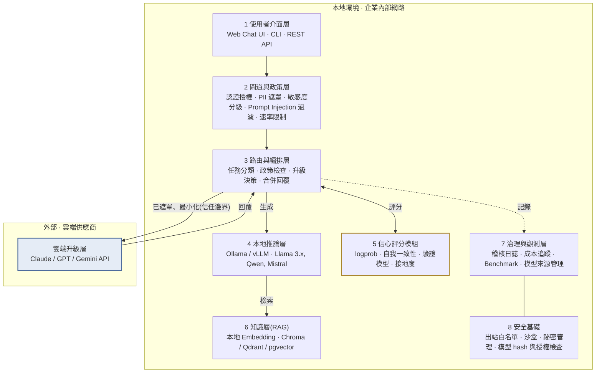
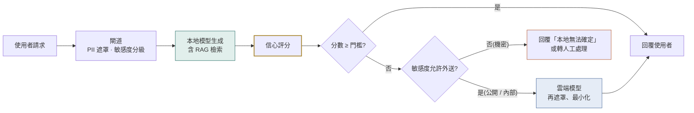
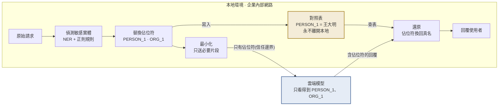

# Hybrid AI Assistant 架構草案

**Capstone · Virtual Gold Inc · 第 3 週 · Scope & Project Charter**

本地優先的混合式企業 AI 助理:以開源模型為主要智慧層,依信心分數與資料敏感度,選擇性升級到雲端模型。

| 版本 | 日期 | 狀態 | 客戶窗口 |
|---|---|---|---|
| v0.1 草案 | 2026-09-07 | 待客戶討論 | Urte Jesina |

---

## 一、問題與目標

企業想部署 AI 助理,但在資料隱私、安全、成本、模型可靠度與供應商依賴之間難以取捨。開源模型可控且隱私佳,但複雜任務的表現不一定夠;雲端模型能力強,卻帶來合規、安全與成本的疑慮。

本專案要設計並評估一套混合架構:**本地開源模型作為主要智慧層**,對每個回覆**量測信心分數**,只有在必要時才**把請求升級到雲端模型**,同時讓敏感資料盡可能留在本地。

## 二、設計原則

| 原則 | 說明 |
|---|---|
| **本地優先** | 所有請求預設由本地模型處理。雲端是升級路徑,不是預設路徑。 |
| **資料分級決定走向** | 機密資料永遠不出本地,不論本地模型信心多低。 |
| **升級要有依據** | 每次升級都要能說出原因:分數、任務類型、預算,並留下紀錄。 |
| **元件可替換** | 模型、向量庫、雲端供應商都經由抽象介面接入,避免廠商鎖定。 |

## 三、系統分層

整個系統只有一個地方會跨越信任邊界:路由層把已遮罩、最小化的內容送到雲端。其餘所有層都在企業內部網路內運作。

**圖一:**虛線框內全部在企業本地環境運作;唯一跨越信任邊界的通道,是路由層送往雲端的已遮罩內容與回傳的回覆。信心評分模組是本專案的研究核心。這條通道的細節見圖三。

| # | 層 | 職責 |
|---|---|---|
| 1 | 使用者介面層 | Web Chat UI、CLI、REST API |
| 2 | 閘道與政策層 | 認證授權、PII 偵測與遮罩、資料敏感度分級、Prompt Injection 過濾、速率限制 |
| 3 | 路由與編排層 | 任務分類、政策檢查、升級決策、合併回覆 |
| 4 | 本地推論層 | Ollama / vLLM;Llama 3.x、Qwen、Mistral |
| 5 | 信心評分模組 | logprob、自我一致性、驗證模型、檢索接地度 |
| 6 | 知識層(RAG) | 本地 Embedding;Chroma / Qdrant / pgvector |
| 7 | 治理與觀測層 | 稽核日誌、成本追蹤、Benchmark、模型來源管理 |
| 8 | 安全基礎 | 出站網路白名單、沙盒、祕密管理、模型 hash 與授權檢查 |
| — | 雲端升級層(外部) | Claude / GPT / Gemini API;只接收已遮罩、最小化的內容 |

## 四、核心請求流程

一個請求從進入到回覆,會經過三個決策點:敏感度分級、信心門檻、以及是否允許外送。三個決策的結果都寫入稽核日誌。

**圖二:**信心評分決定是否需要升級;敏感度分級決定升級是否被允許。兩者都不通過時,系統寧可承認不確定,也不把機密資料送出。

逐步說明:

1. 閘道先做認證與 PII 掃描,並把請求標記為公開、內部或機密。
2. 路由器對任務分類(問答、摘要、程式、推理等),並從 RAG 撈出相關文件片段。
3. 本地模型生成回覆,信心評分模組同時計算分數。
4. 分數高於門檻,直接回覆使用者。
5. 分數低於門檻,且敏感度允許外送,先做遮罩與內容最小化,再送雲端模型。
6. 敏感度為機密,即使信心低也不外送,改為回覆「本地無法確定」或轉人工。
7. 所有決策、分數、成本、延遲都寫入稽核日誌,供後續評測使用。

## 五、信心評分:本專案的研究核心

客戶提案中「量測回覆的信心」是整個題目的技術亮點。建議把它做成獨立模組,同時支援多種策略,並在 Benchmark 中互相比較。期中簡報可以用「升級率、回答品質、成本」三個維度呈現不同策略的取捨。

| 策略 | 原理 | 額外成本 | 準確度傾向 | 適合場景 |
|---|---|---|---|---|
| Token 機率 | 平均 logprob 或 entropy,直接由模型輸出取得 | 幾乎為零 | 普通,容易過度自信 | 第一版 MVP 的基準線 |
| 自我一致性 | 同一問題採樣 N 次,比較答案是否一致 | 延遲 × N | 較好 | 有明確答案的問答、計算 |
| 驗證模型 | 用一個小型本地模型當 judge,替回覆評分 | 多一次小模型推論 | 好,但依賴 judge 品質 | 開放式生成、摘要 |
| 檢索接地度 | 回覆內容是否被 RAG 文件支持 | 低 | 對知識問答很好 | 企業內部知識庫問答 |
| 任務啟發式 | 依任務類型直接決定,例如多步推理預設升級 | 零 | 粗糙,但可預測 | 與其他策略疊加使用 |

> **建議:**MVP 先做 Token 機率加任務啟發式,因為成本最低、最快能跑出第一批數據。之後再逐一加入其他策略做比較。

## 六、去識別化與還原管線(待討論)

圖一那條「已遮罩、最小化」的箭頭,展開後是一條有去有回的管線。真的要往雲走時,這條管線本身就是設計特點,而且「回來之後還原」這一步最常被漏掉。

1. **偵測:**在請求和檢索到的文件片段裡找出敏感實體,例如人名、公司名、金額、帳號、日期。用 NER 模型加正則規則,例如 Presidio 這類工具。
2. **替換成佔位符:**不是塗黑,而是換成編號,例如「王大明」變成 PERSON_1。同一個實體在整段對話中要一直對應同一個編號。
3. **對照表只存本地:**PERSON_1 對應王大明的這張表,永遠不離開本地環境。
4. **最小化後送雲端:**只送這個問題需要的片段,不送整份文件或整段對話歷史。
5. **還原:**雲端回覆裡的佔位符,在本地依對照表換回真名,再回給使用者。

雲端供應商即使把請求存下來,拿到的也是無法對應到真實個體的內容。這一點可以直接寫進安全評估,回應客戶對合規與國際模型的疑慮。

**圖三:**去識別化與還原管線。敏感實體在本地換成佔位符,對照表留在本地,雲端只看到佔位符;回覆進來後再依對照表換回真名。這條管線是「敏感資料留在本地」的實際證據。

### 四個待討論的設計難點

| 難點 | 說明 | 候選做法 |
|---|---|---|
| 佔位符破壞推理 | 「這筆金額比上季高多少」,金額換成 AMOUNT_1 雲端就算不出來。 | 分級處理:身分類換編號;數值類用保留格式的假值,算完再按比例還原;或只保留計算所需的數字。 |
| 偵測漏網率 | NER 抓不到的實體會直接漏出去。 | 用合成資料故意埋入各種格式的敏感資訊,量測管線抓到幾成。這本身是很好的實驗題目。 |
| 語意洩漏 | 名字換掉了,但「布魯克林那家 1997 年成立的顧問公司」仍可推斷身分。 | 無法完全防止。由敏感度分級把這類內容判為不可外送,並評估風險等級。 |
| 還原正確性 | 雲端模型可能把 PERSON_1 改寫成「Person 1」或「那位人士」,還原時對不上。 | 容錯比對;對不上時標記給使用者,不要靜默略過。 |

**在架構中的位置:**偵測與替換屬於第 2 層閘道;對照表、最小化與還原屬於第 3 層路由。
**可量化指標**放進第 7 層治理儀表板:每個請求送出的 token 數、被替換的實體數、還原成功率、漏檢率。這些數字把「隱私」變成看得到的指標。

## 七、安全與治理重點

- **出站網路白名單:**本地推論服務只能連指定的雲端 API,防止模型或套件在背景外傳資料。
- **模型供應鏈檢查:**記錄每個模型的來源、hash 與授權條款。這直接回應客戶對「國際 AI 模型」風險的關注,可把 Qwen、DeepSeek 等模型的評估納入範圍。
- **雙向 Guardrail:**輸入端擋 Prompt Injection,輸出端擋敏感資訊外洩。
- **完整稽核軌跡:**每次升級都能回答「送了什麼、為什麼送、花了多少」。
- **沙盒環境:**學生在自己的電腦上以公開或合成資料作業,不接觸企業內部系統。

## 八、範圍與時程

對應課程 15 週的結構,把工作切成三段。第 7 週期中簡報前,目標是跑出第一份「升級率與品質」的數據。

| 週次 | 階段 | 範圍 |
|---|---|---|
| W1–W3 | 準備 | 組隊、客戶 Kickoff、**架構定案(本週)** |
| W4–W7 | **MVP** | 本地模型 + RAG + 基本信心策略 + 規則式路由 + 基本日誌。**W7 期中簡報。** |
| W8 | 秋假 | — |
| W9–W11 | **擴充** | 多種信心策略比較、雲端升級、去識別化與還原管線、安全評估 |
| W12–W15 | **收斂** | Benchmark 報告、部署建議書、草稿交付、客戶回饋、**W15 最終簡報**(W14 感恩節) |

## 九、需要和客戶確認的決策

1. **「敏感資料」的定義與分級標準由誰訂?**
   影響閘道層的分級規則與整個路由政策。
2. **雲端升級是全自動,還是需要人工核准?**
   影響流程圖中第二個決策點的設計,以及使用者體驗。
3. **允許使用哪些雲端供應商?有沒有地區或合規限制?**
   影響雲端升級層的接入與資料落地要求。
4. **是否要把中國等國際開源模型納入評估?**
   影響安全評估的範圍與模型供應鏈檢查的深度。
5. **硬體限制:團隊電腦能跑多大的模型?**
   決定本地模型選型,7B 到 14B 較實際。
6. **數值類敏感資料(金額、日期)外送時,要換成佔位符還是保留格式的假值?**
   影響去識別化管線的設計,以及雲端模型能做的計算。

## 十、下一步

1. 本週與客戶討論本草案,取得第九節六個問題的答案。
2. 依答案修訂為 v0.2,寫入 Project Charter 的範圍與假設。
3. 第 4 週開始搭建 MVP:先確定本地模型與推論框架,再接 RAG 與基本信心策略。

---

*Hybrid AI Assistant 架構草案 v0.1 · Capstone for Virtual Gold Inc · 2026-09-07*
