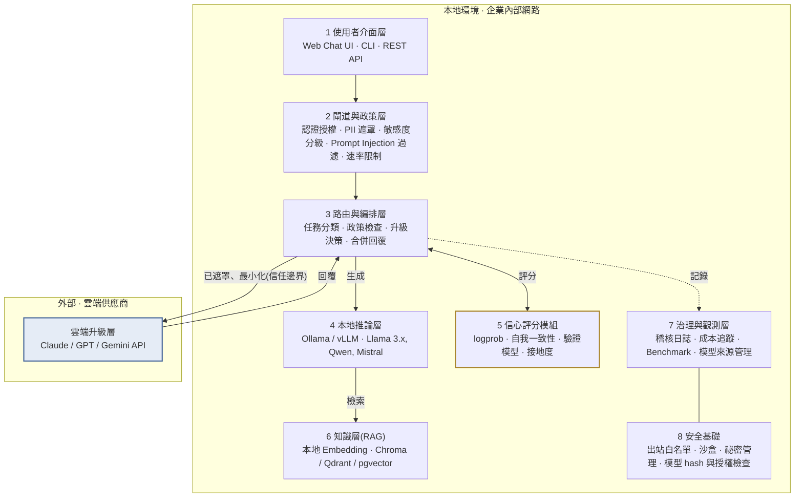
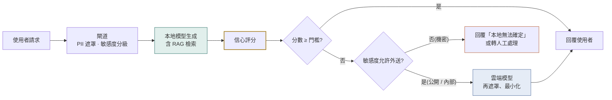
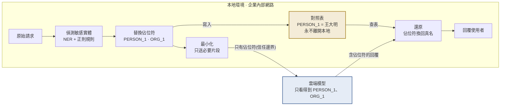

# Hybrid AI Assistant 架構草案

**Capstone · Virtual Gold Inc · 第 3 週 · Scope & Project Charter**

本地優先的混合式企業 AI 助理:以開源模型為主要智慧層,依信心分數與資料敏感度,選擇性升級到雲端模型。

| 版本 | 日期 | 狀態 | 團隊 | 客戶端 |
|---|---|---|---|---|
| v0.2.1 | 2026-09-10 | 團隊討論中 | Anmol · Mark · Yudi · Zhexuan · Karina | Inderpal Bhandari · Alex Bhandari · Urte Jesina |

---

## 一、問題與目標

企業想部署 AI 助理,但在資料隱私、安全、成本、模型可靠度與供應商依賴之間難以取捨。開源模型可控且隱私佳,但複雜任務的表現不一定夠;雲端模型能力強,卻帶來合規、安全與成本的疑慮。

本專案要設計並評估一套混合架構:**本地開源模型作為主要智慧層**,對每個回覆**量測信心分數**,只有在必要時才**把請求升級到雲端模型**,同時讓敏感資料盡可能留在本地。

## 二、設計原則

| 原則 | 說明 |
|---|---|
| **本地優先** | 所有請求預設由本地模型處理。雲端是升級路徑,不是預設路徑。 |
| **資料分級決定走向** | 機密資料永遠不出本地,不論本地模型信心多低。 |
| **升級要有依據** | 每次升級都要能說出原因:分數、任務類型、預算,並留下紀錄。 |
| **元件可替換** | 模型、向量庫、雲端供應商都經由抽象介面接入,避免廠商鎖定。 |

## 三、系統分層

整個系統只有一個地方會跨越信任邊界:路由層把已遮罩、最小化的內容送到雲端。其餘所有層都在企業內部網路內運作。



**圖一:**虛線框內全部在企業本地環境運作;唯一跨越信任邊界的通道,是路由層送往雲端的已遮罩內容與回傳的回覆。信心評分模組是本專案的研究核心。這條通道的細節見圖三。

| # | 層 | 職責 |
|---|---|---|
| 1 | 使用者介面層 | Web Chat UI、CLI、REST API |
| 2 | 閘道與政策層 | 認證授權、PII 偵測與遮罩、資料敏感度分級、Prompt Injection 過濾、速率限制 |
| 3 | 路由與編排層 | 任務分類、政策檢查、升級決策、合併回覆 |
| 4 | 本地推論層 | Ollama / vLLM;Llama 3.x、Qwen、Mistral |
| 5 | 信心評分模組 | logprob、自我一致性、驗證模型、檢索接地度 |
| 6 | 知識層(RAG) | 本地 Embedding;Chroma / Qdrant / pgvector |
| 7 | 治理與觀測層 | 稽核日誌、成本追蹤、Benchmark、模型來源管理 |
| 8 | 安全基礎 | 出站網路白名單、沙盒、祕密管理、模型 hash 與授權檢查 |
| — | 雲端升級層(外部) | Claude / GPT / Gemini API;只接收已遮罩、最小化的內容 |

## 四、核心請求流程

一個請求從進入到回覆,會經過三個決策點:敏感度分級、信心門檻、以及是否允許外送。三個決策的結果都寫入稽核日誌。



**圖二:**信心評分決定是否需要升級;敏感度分級決定升級是否被允許。兩者都不通過時,系統寧可承認不確定,也不把機密資料送出。

逐步說明:

1. 閘道先做認證與 PII 掃描,並把請求標記為公開、內部或機密。
2. 路由器對任務分類(問答、摘要、程式、推理等),並從 RAG 撈出相關文件片段。
3. 本地模型生成回覆,信心評分模組同時計算分數。
4. 分數高於門檻,直接回覆使用者。
5. 分數低於門檻,且敏感度允許外送,先做遮罩與內容最小化,再送雲端模型。
6. 敏感度為機密,即使信心低也不外送,改為回覆「本地無法確定」或轉人工。
7. 所有決策、分數、成本、延遲都寫入稽核日誌,供後續評測使用。

## 五、信心評分:本專案的研究核心

客戶提案中「量測回覆的信心」是整個題目的技術亮點。建議把它做成獨立模組,同時支援多種策略,並在 Benchmark 中互相比較。期中簡報可以用「升級率、回答品質、成本」三個維度呈現不同策略的取捨。

| 策略 | 原理 | 額外成本 | 準確度傾向 | 適合場景 |
|---|---|---|---|---|
| Token 機率 | 平均 logprob 或 entropy,直接由模型輸出取得 | 幾乎為零 | 普通,容易過度自信 | 第一版 MVP 的基準線 |
| 自我一致性 | 同一問題採樣 N 次,比較答案是否一致 | 延遲 × N | 較好 | 有明確答案的問答、計算 |
| 驗證模型 | 用一個小型本地模型當 judge,替回覆評分 | 多一次小模型推論 | 好,但依賴 judge 品質 | 開放式生成、摘要 |
| 檢索接地度 | 回覆內容是否被 RAG 文件支持 | 低 | 對知識問答很好 | 企業內部知識庫問答 |
| 任務啟發式 | 依任務類型直接決定,例如多步推理預設升級 | 零 | 粗糙,但可預測 | 與其他策略疊加使用 |

> **建議:**MVP 先做 Token 機率加任務啟發式,因為成本最低、最快能跑出第一批數據。之後再逐一加入其他策略做比較。

## 六、去識別化與還原管線(待討論)

圖一那條「已遮罩、最小化」的箭頭,展開後是一條有去有回的管線。真的要往雲走時,這條管線本身就是設計特點,而且「回來之後還原」這一步最常被漏掉。

1. **偵測:**在請求和檢索到的文件片段裡找出敏感實體,例如人名、公司名、金額、帳號、日期。用 NER 模型加正則規則,例如 Presidio 這類工具。
2. **替換成佔位符:**不是塗黑,而是換成編號,例如「王大明」變成 PERSON_1。同一個實體在整段對話中要一直對應同一個編號。
3. **對照表只存本地:**PERSON_1 對應王大明的這張表,永遠不離開本地環境。
4. **最小化後送雲端:**只送這個問題需要的片段,不送整份文件或整段對話歷史。
5. **還原:**雲端回覆裡的佔位符,在本地依對照表換回真名,再回給使用者。

雲端供應商即使把請求存下來,拿到的也是無法對應到真實個體的內容。這一點可以直接寫進安全評估,回應客戶對合規與國際模型的疑慮。



**圖三:**去識別化與還原管線。敏感實體在本地換成佔位符,對照表留在本地,雲端只看到佔位符;回覆進來後再依對照表換回真名。這條管線是「敏感資料留在本地」的實際證據。

### 四個待討論的設計難點

| 難點 | 說明 | 候選做法 |
|---|---|---|
| 佔位符破壞推理 | 「這筆金額比上季高多少」,金額換成 AMOUNT_1 雲端就算不出來。 | 分級處理:身分類換編號;數值類用保留格式的假值,算完再按比例還原;或只保留計算所需的數字。 |
| 偵測漏網率 | NER 抓不到的實體會直接漏出去。 | 用合成資料故意埋入各種格式的敏感資訊,量測管線抓到幾成。這本身是很好的實驗題目。 |
| 語意洩漏 | 名字換掉了,但「布魯克林那家 1997 年成立的顧問公司」仍可推斷身分。 | 無法完全防止。由敏感度分級把這類內容判為不可外送,並評估風險等級。 |
| 還原正確性 | 雲端模型可能把 PERSON_1 改寫成「Person 1」或「那位人士」,還原時對不上。 | 容錯比對;對不上時標記給使用者,不要靜默略過。 |

**在架構中的位置:**偵測與替換屬於第 2 層閘道;對照表、最小化與還原屬於第 3 層路由。
**可量化指標**放進第 7 層治理儀表板:每個請求送出的 token 數、被替換的實體數、還原成功率、漏檢率。這些數字把「隱私」變成看得到的指標。

## 七、評測設計與資料集

同一批測試題跑三種配置,才能回答客戶真正的問題:混合架構省了多少成本、犧牲了多少品質、洩漏了多少資料。這是期中與期末簡報的主要實驗設計。

客戶在 9 月 3 日會議明確要求:以業界通用的 benchmark 評估,並證明本地與混合配置的效能可與雲端模型相當。Alex 指出本地與雲端的效能落差是本專案最關鍵的挑戰,Inderpal 指出成本是採用本地模型的另一主要動機,因此效能與成本兩項數據是客戶判斷專案成敗的依據。

| 配置 | 說明 | 用途 |
|---|---|---|
| 純本地 | 所有請求只由本地模型回答,不升級 | 品質下限、成本下限、隱私上限 |
| 混合 | 本地優先,依信心分數與敏感度決定升級 | 本專案的提案,量測它落在兩端之間的哪裡 |
| 純雲端 | 所有請求直接送雲端模型 | 品質上限、成本上限、隱私下限 |

**每個配置都記錄六個指標:**準確率、延遲、每題成本、升級率、PII 洩漏率、Prompt Injection 抵抗力。混合配置另外畫出第五節提到的升級率對正確率曲線、AUROC 與校準誤差。

### 資料集與基準

客戶只提供公開資料,所以每個評測面向都用既有的公開資料集,不從零標註。所有項目皆公開、授權允許、不含個資。

| 用途 | 資料集 / 工具 | 來源 | 為什麼適合 |
|---|---|---|---|
| 一般能力落差 | MMLU(子集) | Hugging Face cais/mmlu | 量測小型本地模型與雲端模型在各知識領域的品質差距 |
| 推理與升級驗證 | GSM8K | Hugging Face openai/gsm8k | 本地模型常答不好的數學推理題,用來驗證路由有沒有正確升級 |
| 企業 / SMB 情境 | 客服工單、B2B SaaS 樣本 | Hugging Face Tobi-Bueck/customer-support-tickets、Kaludi/Customer-Support-Responses;Kaggle sarahdaily/b2b-saas-hubspot | 只當樣式與結構參考,團隊用 LLM 生成合成的工單、郵件、備忘錄,全程不用真實資料 |
| 路由基準 | RouterBench | arXiv:2403.12031 | 專為多模型路由的成本、品質、延遲取捨設計的基準與評測方法 |
| 信心校準 / 幻覺偵測 | TruthfulQA、HaluEval | Hugging Face;GitHub EdinburghNLP/awesome-hallucination-detection | 測信心分數是否真的追蹤事實正確性,對應提案中的信心評分目標 |
| 安全:PII 遮罩 | Presidio 評測模組 | GitHub microsoft/presidio | 內建評測方法,不必自建標註語料;也可用來量測第六節的漏檢率 |
| 安全:Prompt Injection | Prompt Injection & Benign Prompt Dataset | Kaggle cyberprince | 注入與正常提示的標註集,用來紅隊測試安全閘道 |

> **期中目標:**第 7 週期中簡報前,至少要有「純本地 vs 混合」在 MMLU 子集與 GSM8K 上的準確率與升級率。三配置完整跑完放在第 9 到 11 週。

## 八、安全與治理重點

- **出站網路白名單:**本地推論服務只能連指定的雲端 API,防止模型或套件在背景外傳資料。
- **模型供應鏈檢查:**記錄每個模型的來源、hash 與授權條款。這直接回應客戶對「國際 AI 模型」風險的關注,可把 Qwen、DeepSeek 等模型的評估納入範圍。
- **雙向 Guardrail:**輸入端擋 Prompt Injection,輸出端擋敏感資訊外洩。
- **完整稽核軌跡:**每次升級都能回答「送了什麼、為什麼送、花了多少」。
- **沙盒環境:**學生在自己的電腦上以公開或合成資料作業,不接觸企業內部系統。

## 九、範圍與時程

時程依課程 15 週結構安排,不變。工作切成三段,第 7 週期中簡報前要跑出第一批數據。

| 週次 | 階段 | 範圍 |
|---|---|---|
| W1–W3 | 準備 | 組隊、客戶 Kickoff、**架構定案(本週)** |
| W4–W7 | **MVP** | 本地模型 + 基本信心策略 + 路由 + PII 閘道 + 評測 harness。**W7 期中簡報。** |
| W8 | 秋假 | — |
| W9–W11 | **擴充** | 三配置完整評測、多策略比較、去識別化與還原、紅隊測試 |
| W12–W15 | **收斂** | Benchmark 報告、治理建議、草稿交付、客戶回饋、**W15 最終簡報**(W14 感恩節) |

與客戶初期每週開會,專案定義清楚後改為雙週,由 Urte 排程。

### MVP:團隊承諾交付

五個人都是全職研究生並修滿課程,這個專案約占一學期三分之一的學分。因此目標是「可運作的原型加嚴謹的評測」,不是產品級平台。盡量用現成的開源元件,把力氣放在整合、評測與安全治理分析。

- **路由與編排:**團隊撰寫路由政策;閘道工具待定(見第十一節第 1 項)。
- **本地推論:**Llama 3.1 8B 為主力,Qwen3 8B 為程式與多語言題目的備選;透過 Ollama 跑在模擬地端的 GPU 沙盒上(見下方「部署環境」)。團隊 2026-09-10 決定:不在筆電上跑 LLM,筆電只做開發。
- **信心評分:**自我一致性或 token logprob 作為基準線訊號。
- **PII 遮罩閘道:**位於路由與任何雲端呼叫之間,直接落實「敏感資料留在本地」。
- **雲端升級:**一家主流企業級 API,只在低信心時呼叫。
- **評測與日誌 harness:**第七節的三配置與六指標。
- **介面:**不做圖形介面,只做 CLI 或 REST API(9 月 3 日決議,客戶要求優先架構本身)。
- **待定:**最簡版 RAG 知識層、資料敏感度分級(見第十一節第 2、3 項)。

### Stretch goals:MVP 提早完成才做

- 任務感知路由:依問題類型與複雜度路由,而非只看信心分數,以 RouterBench 方法評估。
- 第二個本地模型 A/B 比較,或用訓練式路由器取代門檻規則。
- 去識別化管線的數值類假值處理與還原容錯。
- 更多 Prompt Injection 與 jailbreak 類別的紅隊測試。
- 本地模型增強(9 月 3 日會議確認在範圍內):量化等級比較、prompt 調校、以合成資料做 LoRA 微調。
- 給高階主管的摘要簡報,把發現轉成治理建議。

### 部署環境:以雲端沙盒模擬地端

團隊於 2026-09-10 決定不在筆電上跑 LLM。模型改跑在雲端沙盒的 GPU 主機上,客戶在 9 月 3 日會議承諾提供沙盒,CMU Public Cloud Services 為備案;筆電只負責開發。地端的本質是「誰控制它、資料能不能出去」,所以沙盒要模擬的是那條邊界,而且要能被驗證。

```
internal 網路(無對外連線)          egress 網路(只到白名單)
├── ollama      本地模型             └── egress-proxy  唯一出口,記錄每次請求
├── chroma      向量庫 / RAG                 ↑
├── presidio    去識別化                     │
├── audit-db    稽核日誌                     │
└── router  ── 同時掛在兩個網路 ─────────────┘
```

- **網路邊界:**VM 放在私有網路,外部進不來(只留 SSH 或 Tailscale 給團隊),內部出不去,唯一例外是白名單內的雲端 LLM API。這就是第 8 層的出站白名單。
- **容器隔離:**Docker Compose 開兩個網路。模型、向量庫、去識別化、稽核日誌全在 internal,連 DNS 都解析不到外面;只有 router 同時掛兩個網路,而且連外必須經過出口 proxy。圖一的信任邊界因此是真的隔出來的,不只是畫出來的。
- **稽核出口:**proxy 只放行白名單網域並記錄每次請求內容。PII 洩漏率、每請求送出的 token 數都從這裡量;把 proxy 關掉就是純本地配置。
- **可驗證:**三個自動化測試放進評測 harness:模型容器連外預期失敗;router 連白名單外預期失敗、白名單內成功;含真名的請求在 proxy 日誌中只出現佔位符。期中可現場跑。
- **硬體情境:**同一批題目在無 GPU(CPU)、T4、A10G、4-bit 對 8-bit、完全離線五種情境各跑一次,回答客戶「地端硬體要花多少才能少送多少上雲」,並滿足 SOW 對 locally attainable hardware 需求的報告要求。


## 十、預設方案與待客戶確認的假設

客戶希望團隊直接提出預設方案,而不是把問題丟回去。以下每一項都給了一個預設,團隊會照此進行,除非客戶在第 4 週開工前另有指示。

| 項目 | 預設方案 | 理由 | 客戶可調整處 |
|---|---|---|---|
| 敏感資料分級 | 三級:公開、內部、機密。由團隊依常見企業分級定義,機密永不外送。 | 客戶尚未提供分級標準,先給一個可運作的預設。 | 提供自家分級標準即替換。 |
| 升級核准 | 全自動,每次升級寫入稽核日誌;人工核准列為 stretch。 | 一學期內可實作,且符合「升級要有依據」原則。 | 若要求人工核准,在流程第二決策點加審核。 |
| 雲端供應商 | MVP 只接一家:OpenAI 或 Anthropic,兩家都公開企業級資料保留承諾。 | 減少變數;多供應商比較列為 stretch。 | 指定供應商、地區或合規限制。 |
| 國際開源模型 | Qwen3 8B 作為備選並納入供應鏈檢查(來源、hash、授權)。 | 客戶提案明確關切國際模型風險,納入評估才能給結論。 | 可要求排除。 |
| 硬體與運算環境 | 模型跑在 GPU 沙盒(T4 等級,16GB)上模擬地端;8B 級模型 4-bit 量化。筆電不跑 LLM。 | 團隊 2026-09-10 決定;客戶 9 月 3 日承諾提供沙盒。 | 確認沙盒規格與費用;提供 A10G 級則可測 14B。 |
| 數值類敏感資料 | MVP 一律換成佔位符;保留格式的假值列為 stretch。 | 先確保不外洩,再追求可計算。 | 見第十一節第 4 項。 |
| 治理框架 | NIST AI RMF(Govern、Map、Measure、Manage),標註 ISO/IEC 42001 可延伸之處。 | 免費、自我評估、適合一學期的實務風險評估。 | 需認證等級則改以 ISO 42001 為主。 |
| 資料來源 | 全部使用第七節的公開資料集加 LLM 生成的合成資料,不用任何真實資料。 | 客戶只提供公開資料。 | 提供範例文件或格式可作為額外種子。 |
| 使用情境 / 產業 | 預設聚焦金融服務類中小企業的文件工作流:問答、摘要、資訊擷取。 | 客戶 9 月 3 日表示可聚焦特定產業,且定了情境才會提供資料。 | 改為房地產或其他產業。 |
| 費用負擔 | 雲端模型 API 額度與沙盒算力由客戶提供;若無,改用 CMU Public Cloud Services,預算上限 100 美元。 | SOW 尚未載明費用歸屬,需確認後寫入。 | 指定額度上限或供應商帳號。 |

## 十一、團隊待討論事項(代辦)

- [ ] **工具選型,尚未定案。**組員提案:LiteLLM 當路由閘道、Ollama 跑本地模型、Presidio 做 PII 偵測、RouteLLM 的方法做路由訊號。要確認:LiteLLM 能否掛自訂路由政策與去識別化鉤子;RouteLLM 是「看問題」的事前路由,和「看回答」的事後信心評分是兩回事,要分開評估;Ollama 取 logprobs 是否方便,還是改用 vLLM。
- [ ] **RAG 知識層留不留。**組員版沒有,本草案有。影響:企業文件問答的示範價值、檢索接地度這個信心策略、去識別化是否要處理文件片段。傾向保留最簡版,時間不夠再砍並告知客戶。
- [ ] **資料敏感度分級是否納入 MVP。**組員版只有 PII 遮罩,沒有「機密永不外送」的規則。實作上只是路由層多一條規則,成本低,建議納入。
- [ ] **去識別化與還原管線放 MVP 還是 stretch。**還原這一步組員版沒有;數值類用佔位符還是假值也要一起定。
- [ ] **本地模型與沙盒。**Llama 3.1 8B 主力、Qwen3 8B 備選;已決定不在筆電跑 LLM。向客戶確認 9 月 3 日承諾的沙盒規格、取得時間與費用;確認雲端 API 額度;CMU 雲端為備案。
- [ ] **雲端供應商二選一。**OpenAI 或 Anthropic。比較企業資料保留條款與價格後決定。
- [ ] **W7 期中要展示哪些數據。**建議至少:純本地 vs 混合在 MMLU 子集與 GSM8K 上的準確率與升級率。
- [ ] **組員提案文件待修正。**Llama 3.3 8B 應為 Llama 3.1 8B(3.3 只有 70B);Qwen3 7B 應為 Qwen3 8B(7B 是 Qwen2.5);圖中「高信心直接回覆」的箭頭不應經過 PII 閘道;模型數據改引 Meta 與 Qwen 官方 model card,框架改引 NIST 原文;時程對齊課程的 W7 期中與 W8 秋假。
- [ ] **使用情境與產業。**客戶說定了情境才給資料。預設金融服務類中小企業文件工作流,本週向客戶確認。
- [ ] **分工。**路由、模型與推論、評測 harness、安全與去識別化、文件與簡報,五個人各認領一塊。

## 十二、下一步

1. 本週團隊會議走完第十一節的待討論清單,先定工具選型與 RAG 去留。
2. 把第十節的預設方案送客戶確認;客戶不反對即照預設進行。
3. 第 4 週開工:確定本地模型與推論框架,搭起評測 harness 骨架,目標 W7 前跑出純本地 vs 混合的第一批數據。

---

*Hybrid AI Assistant 架構草案 v0.2.1 · Capstone for Virtual Gold Inc · 2026-09-10*
