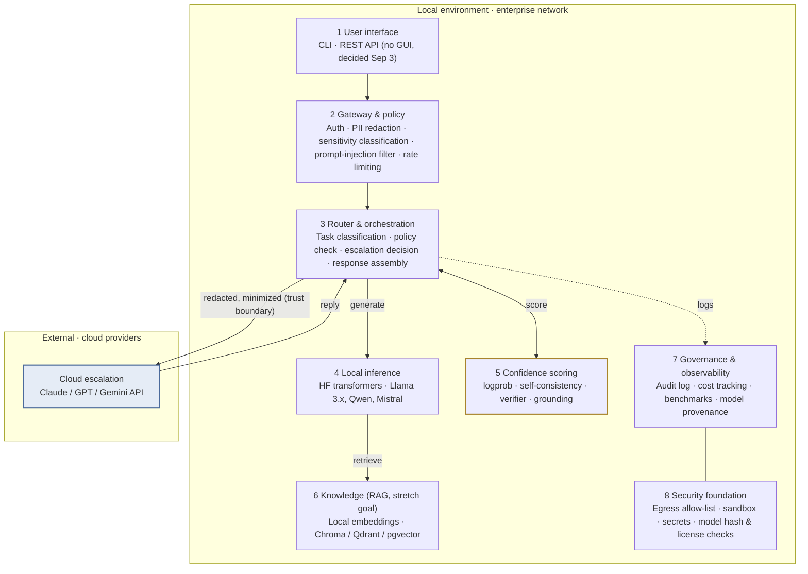
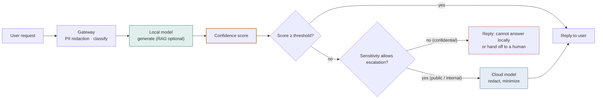
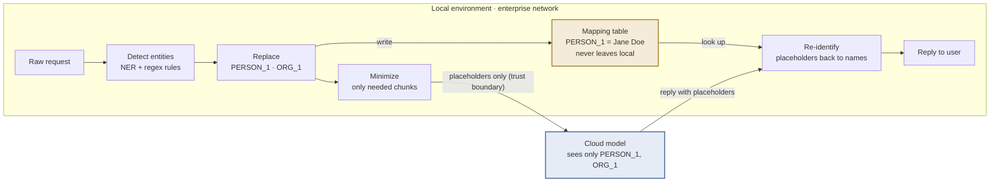

# Hybrid AI Assistant Architecture Draft

**Capstone · Virtual Gold Inc · Week 4 · Project Plan**

A local-first enterprise AI assistant: open-source models are the primary intelligence layer, and requests escalate to cloud models only when confidence scores and data sensitivity allow.

| Version | Date | Status | Team | Client |
|---|---|---|---|---|
| v0.3 | 2026-09-15 | Team decisions of Sep 15 recorded; client answers pending | Anmol · Mark · Yudi · Zhexuan · Karina | Inderpal Bhandari · Alex Bhandari · Urte Jesina |
| v0.2.1 | 2026-09-10 | Team discussion | Anmol · Mark · Yudi · Zhexuan · Karina | Inderpal Bhandari · Alex Bhandari · Urte Jesina |

---

## 1. Problem and objective

Organizations want to deploy AI assistants but struggle to balance data privacy, security, cost, model reliability, and vendor dependence. Open-source models offer control and privacy but may fall short on complex tasks. Cloud models are more capable but raise compliance, security, and cost concerns.

This project designs and evaluates a hybrid architecture: **local open-source models act as the primary intelligence layer**, every response gets a **measured confidence score**, and requests are **escalated to cloud models only when necessary**, keeping sensitive data local whenever possible.

## 2. Design principles

| Principle | Meaning |
|---|---|
| **Local first** | Every request is handled by a local model by default. The cloud is an escalation path, not the default path. |
| **Data classification decides routing** | Confidential data never leaves the local environment, regardless of how low local confidence is. |
| **Escalation must be justified** | Every escalation can state its reason: score, task type, budget. All of it is logged. |
| **Replaceable components** | Models, vector stores, and cloud providers plug in through abstract interfaces to avoid vendor lock-in. |

## 3. System layers

There is exactly one place where the system crosses the trust boundary: the routing layer sends redacted, minimized content to the cloud. Every other layer runs inside the enterprise network.



**Figure 1.** Everything inside the local box runs in the enterprise environment. The only channel crossing the trust boundary carries redacted content from the router to the cloud and the reply back. The confidence scoring module is the research core of this project. See Figure 3 for the detail of this channel.

| # | Layer | Responsibilities |
|---|---|---|
| 1 | User interface | CLI, REST API; no GUI (decided Sep 3) |
| 2 | Gateway & policy | Auth, PII detection & redaction, sensitivity classification, prompt-injection filter, rate limiting |
| 3 | Router & orchestration | Task classification, policy check, escalation decision, response assembly |
| 4 | Local inference | HF transformers; Llama 3.x, Qwen, Mistral |
| 5 | Confidence scoring | logprob, self-consistency, verifier model, retrieval grounding |
| 6 | Knowledge (RAG), stretch goal | Local embeddings; Chroma / Qdrant / pgvector. Not in the MVP (decided 2026-09-15) |
| 7 | Governance & observability | Audit log, cost tracking, benchmarks, model provenance |
| 8 | Security foundation | Egress allow-list, sandbox, secrets management, model hash & license checks |
| — | Cloud escalation (external) | Claude / GPT / Gemini API; receives only redacted, minimized content |

## 4. Core request flow

A request passes three decision points on its way to a reply: sensitivity classification, the confidence threshold, and whether escalation is permitted. All three outcomes are written to the audit log.



**Figure 2.** The confidence score decides whether escalation is needed; the sensitivity class decides whether escalation is allowed. When both fail, the system admits uncertainty rather than sending confidential data out.

Step by step:

1. The gateway authenticates the user, scans for PII, and tags the request as public, internal, or confidential.
2. The router classifies the task (Q&A, summary, code, reasoning); document retrieval through RAG is a stretch goal.
3. The local model generates a response and the confidence module scores it.
4. If the score meets the threshold, the response is returned directly.
5. If the score is below the threshold and the sensitivity class permits, the content is redacted and minimized, then sent to a cloud model.
6. If the class is confidential, the request is never sent out. The system replies that it cannot answer locally or hands off to a human.
7. Every decision, score, cost, and latency is written to the audit log for later evaluation.

## 5. Confidence scoring: the research core

The client proposal's "measure confidence in generated responses" is the technical highlight of this project. We recommend building it as a standalone module that supports several strategies, then comparing them in the benchmark. The midpoint presentation can show the trade-offs across three dimensions: escalation rate, answer quality, and cost.

| Strategy | How it works | Extra cost | Accuracy tendency | Best for |
|---|---|---|---|---|
| Token probability | Mean logprob or entropy, taken directly from model output | Near zero | Moderate; prone to overconfidence | Baseline for the MVP |
| Self-consistency | Sample the same question N times and check agreement | Latency × N | Better | Q&A and calculations with a definite answer |
| Verifier model | A small local model acts as judge and grades the response | One extra small inference | Good, but depends on judge quality | Open-ended generation, summaries |
| Retrieval grounding | Whether the response is supported by retrieved RAG documents | Low | Very good for knowledge Q&A | Internal knowledge-base questions |
| Task heuristics | Decide by task type, e.g. multi-step reasoning escalates by default | Zero | Coarse but predictable | Stacked on top of other strategies |

> **Recommendation:** start the MVP with token probability plus task heuristics. They cost the least and produce the first batch of data fastest. Add the other strategies one at a time for comparison.

## 6. De-identification and re-identification pipeline (for discussion)

The "redacted, minimized" arrow in Figure 1 unfolds into a round-trip pipeline. When a request really has to go to the cloud, this pipeline is itself a design feature, and the "map it back on return" step is the one most often forgotten.

1. **Detect:** find sensitive entities in the request and the retrieved document chunks: names, organizations, amounts, account numbers, dates. Use an NER model plus regex rules, for example a tool like Presidio.
2. **Replace with placeholders:** not blacked out, but swapped for an identifier, e.g. "Jane Doe" becomes PERSON_1. The same entity keeps the same identifier for the whole conversation.
3. **Keep the mapping table local:** the table that says PERSON_1 = Jane Doe never leaves the local environment.
4. **Minimize, then send:** send only the chunks this question needs, never the whole document or conversation history.
5. **Re-identify:** placeholders in the cloud reply are mapped back to real names locally before the reply reaches the user.

Even if a cloud provider stores the request, what it holds cannot be linked to a real individual. This goes straight into the security assessment and answers the client's compliance and international-model concerns.



**Figure 3.** De-identification and re-identification pipeline. Sensitive entities are swapped for placeholders locally, the mapping table stays local, and the cloud sees only placeholders; the reply is mapped back to real names on the way in. This pipeline is the concrete evidence behind "sensitive data stays local."

### Four design challenges for discussion

| Challenge | What goes wrong | Candidate approaches |
|---|---|---|
| Placeholders break reasoning | "How much higher is this amount than last quarter?" cannot be computed once the amount is AMOUNT_1. | Tiered handling: identity fields become identifiers; numeric fields get format-preserving fake values that are scaled back afterwards; or keep only the numbers the calculation needs. |
| Detection miss rate | Any entity the NER model misses leaks straight through. | Plant sensitive data in many formats into synthetic datasets and measure how much the pipeline catches. A good experiment in its own right. |
| Semantic leakage | The name is gone, but "the consulting firm in Brooklyn founded in 1997" still identifies it. | Cannot be fully prevented. Let sensitivity classification mark such content as non-exportable and rate the residual risk. |
| Re-identification accuracy | The cloud model may rewrite PERSON_1 as "Person 1" or "that individual", so the lookup fails. | Fuzzy matching; flag unmatched placeholders to the user instead of silently dropping them. |

**Where it sits in the architecture:** detection and replacement belong to layer 2, the gateway; the mapping table, minimization, and re-identification belong to layer 3, the router.
**Measurable metrics** go on the layer 7 governance dashboard: tokens sent per request, entities replaced, re-identification success rate, miss rate. These numbers turn "privacy" into something visible.

## 7. Evaluation design and datasets

The same test set runs under three configurations. That is the only way to answer the client's real question: how much cost the hybrid design saves, how much quality it gives up, and how much data it leaks. This is the main experimental design for the midpoint and final presentations.

At the Sep 3 meeting the client was explicit: evaluate with established general-purpose industry benchmarks and show that the local and hybrid configurations perform comparably to cloud models. Alex named the local-versus-cloud performance gap as the project's critical challenge, and Inderpal named cost as the other main driver for adopting a local model, so performance and cost numbers are how the client will judge success.

| Configuration | Description | Purpose |
|---|---|---|
| Local-only | Every request answered by the local model, no escalation | Quality floor, cost floor, privacy ceiling |
| Hybrid | Local first; confidence score and sensitivity decide escalation | This project's proposal; measure where it lands between the two extremes |
| Cloud-only | Every request sent straight to the cloud model | Quality ceiling, cost ceiling, privacy floor |

**Six metrics per configuration:** accuracy, latency, cost per query, escalation rate, PII-leak rate, prompt-injection resistance. For the hybrid configuration we also plot the escalation-rate vs accuracy curve, AUROC, and calibration error from section 5.

### Datasets and benchmarks

The client provides public data only, so each evaluation dimension uses an established public dataset instead of labeling from scratch. All items are public, license-permitting, and contain no PII.

| Purpose | Dataset / tool | Source | Why it fits |
|---|---|---|---|
| General capability gap | MMLU (subset) | Hugging Face cais/mmlu | Measures the quality gap between a small local model and a frontier cloud model across knowledge domains |
| Reasoning and escalation check | GSM8K | Hugging Face openai/gsm8k | Math reasoning where local models often fail; validates whether the router escalates correctly |
| Enterprise / SMB context | Support-ticket sets, B2B SaaS sample | Hugging Face Tobi-Bueck/customer-support-tickets, Kaludi/Customer-Support-Responses; Kaggle sarahdaily/b2b-saas-hubspot | Style and structure reference only; the team generates synthetic tickets, emails, and memos with an LLM. No real data at any point |
| Routing benchmark | RouterBench | arXiv:2403.12031 | Benchmark and methodology built for multi-LLM routing cost, quality, and latency trade-offs |
| Confidence calibration / hallucination | TruthfulQA, HaluEval | Hugging Face; GitHub EdinburghNLP/awesome-hallucination-detection | Tests whether the confidence score actually tracks factual correctness, the core of the brief's confidence objective |
| Security: PII redaction | Presidio evaluation module | GitHub microsoft/presidio | Built-in evaluation method, no hand-labeled corpus needed; also measures the miss rate from section 6 |
| Security: prompt injection | Prompt Injection & Benign Prompt Dataset | Kaggle cyberprince | Labeled injection vs benign prompts for red-teaming the security gate |

> **Midpoint target (set 2026-09-15):** before the W7 midpoint, run all three configurations on the MMLU subset and GSM8K with token logprob as the only confidence signal, and report accuracy, escalation rate, cost per query and latency. Every query is sent to the cloud once and cached, so cloud-only comes from the same run. The remaining confidence strategies, PII-leak rate and prompt-injection resistance belong in weeks 9 to 11.

## 8. Security and governance

- **Egress allow-list:** local inference services can only reach the approved cloud APIs, preventing models or packages from leaking data in the background.
- **Model supply-chain checks:** record every model's source, hash, and license. This directly addresses the client's concern about international AI models and lets us include Qwen, DeepSeek, and similar models in the evaluation.
- **Two-way guardrails:** block prompt injection on input and sensitive-data leakage on output.
- **Complete audit trail:** every escalation can answer "what was sent, why, and at what cost."
- **Sandboxed environment:** students work in the client-provided cloud sandbox (models) and on their own laptops (development only), always with public or synthetic data, and never touch enterprise systems.

## 9. Scope and timeline

The timeline follows the 15-week course structure and does not change. The work splits into three phases, with the first numbers due before the week 7 midpoint.

| Weeks | Phase | Scope |
|---|---|---|
| W1–W3 | Setup | Team formation, client kickoff, architecture sign-off |
| W4–W7 | **MVP (now)** | Local model + basic confidence strategy + router + PII gate + evaluation harness. **W7 midpoint presentation.** |
| W8 | Fall break | — |
| W9–W11 | **Extend** | Full three-configuration run, remaining confidence strategies, red-teaming, format-preserving fake values |
| W12–W15 | **Converge** | Benchmark report, governance recommendations, draft deliverable, client feedback, **W15 final presentation** (W14 Thanksgiving) |

Client meetings weekly during discovery, moving to bi-weekly once the project is defined; Mark schedules.

### MVP: the team's committed deliverable

All five team members are full-time graduate students carrying a full course load; this project is roughly a third of one semester's credits. The target is therefore a working prototype plus a rigorous evaluation, not a production platform. Existing open-source components are preferred so effort goes into integration, evaluation, and the security and governance analysis.

- **Router and orchestration:** our own Python router: confidence threshold plus the confidential-stays-local rule, calling the local model in-process and the cloud provider's SDK. No gateway framework (decided 2026-09-15).
- **Local inference:** Llama 3.1 8B as the primary model, Qwen3 8B as the secondary for code and multilingual queries; loaded with HF transformers (4-bit via bitsandbytes) on a GPU sandbox that simulates on-premises (see "Deployment environment" below). Team decision 2026-09-10: no LLMs on laptops, laptops are for development only.
- **Confidence scoring:** token logprob as the midpoint baseline; the other strategies in section 5 are compared in weeks 9 to 11.
- **PII redaction gate and re-identification:** Presidio redaction between the router and any cloud call, and a per-request placeholder mapping table that restores the reply (decided 2026-09-15); numeric data uses placeholders.
- **Cloud escalation:** one mainstream enterprise-grade API, called only on low confidence.
- **Evaluation and logging harness:** the three configurations and six metrics from section 7.
- **Interface:** no GUI; CLI or REST API only (decided Sep 3, the client wants the architecture prioritized).
- **Data sensitivity classification:** three levels; confidential never leaves local regardless of confidence (decided 2026-09-15).
- **RAG knowledge layer:** stretch goal, not in the MVP (decided 2026-09-15).

### Stretch goals: only if the MVP lands early

- Task-aware routing by query type and complexity, not confidence alone, evaluated with the RouterBench methodology.
- A minimal RAG knowledge layer over synthetic enterprise documents, with retrieval grounding as an extra confidence signal (deferred 2026-09-15).
- A second local model for A/B comparison, or a small trained router instead of a threshold rule.
- Format-preserving fake values and fuzzy re-identification in the de-identification pipeline.
- Deeper red-teaming across more prompt-injection and jailbreak categories.
- Local model enhancement (confirmed in scope at the Sep 3 meeting): quantization comparison, prompt tuning, LoRA fine-tuning on synthetic data.
- An executive summary deck translating findings into governance recommendations.

### Deployment environment: a cloud sandbox that simulates on-premises

On 2026-09-10 the team decided not to run LLMs on laptops. Models run on a GPU host in a cloud sandbox instead: the client offered a sandbox at the Sep 3 meeting; laptops are for development only. What makes an environment "on-premises" is who controls it and whether data can leave, so the sandbox simulates that boundary, and the boundary must be verifiable.

```
internal network (no internet)      egress network (allow-list only)
├── llm-server  local model (HF transformers) └── egress-proxy  single exit, logs every request
├── chroma      vector store (RAG, stretch)  ↑
├── presidio    de-identification            │
├── audit-db    audit log                    │
└── router  ── attached to both networks ────┘
```

- **Network boundary:** the VM sits in a private network. Nothing comes in except SSH or Tailscale for the team; nothing goes out except the allow-listed cloud LLM API. This is the layer 8 egress allow-list.
- **Container isolation:** Docker Compose with two networks. The model, vector store, de-identification, and audit log live on `internal`, which cannot even resolve external DNS; only the router is attached to both networks, and it reaches the internet only through the egress proxy. The trust boundary in Figure 1 is enforced, not just drawn.
- **Audited exit:** the proxy allows only allow-listed domains and logs every request. PII-leak rate and tokens sent per request are measured here; turning the proxy off gives the local-only configuration.
- **Verifiable:** three automated tests in the evaluation harness: outbound from the model container must fail; the router must fail outside the allow-list and succeed inside it; a request containing a real name must appear in the proxy log with placeholders only. Runnable live at the midpoint.
- **Hardware scenarios:** run the same test set under no GPU (CPU), T4, A10G, 4-bit vs 8-bit, and fully offline, to answer "how much on-prem hardware buys how much less cloud traffic" and to satisfy the SOW requirement to report needs for locally attainable hardware.


## 10. Proposed defaults and assumptions for the client to confirm

The client prefers concrete defaults over open questions. Each item below has a default the team will proceed on unless the client redirects before implementation starts in week 4.

| Item | Default | Why | Client can change |
|---|---|---|---|
| Sensitivity levels | Three levels: public, internal, confidential. Defined by the team from common enterprise practice; confidential never leaves local. | No client classification standard yet; start with a working default. | Replace with the client's own standard. |
| Escalation approval | Fully automatic, every escalation logged; human approval is a stretch goal. | Feasible in one semester and consistent with "escalation must be justified". | Add a review step at the second decision point. |
| Cloud provider | One provider for the MVP: whichever the client supplies API credits or an enterprise account for; Anthropic if the client has no preference. Both publish enterprise data-retention commitments. | Fewer variables; multi-provider comparison is a stretch goal. | Name a provider, region, or compliance constraint. |
| International open-source models | Qwen3 8B as the secondary model, with supply-chain checks (source, hash, license). | The brief explicitly raises international-model risk; evaluating one is the only way to conclude. | Ask to exclude it. |
| Hardware and compute environment | Models run on a GPU sandbox (T4-class, 16 GB) that simulates on-premises; 8B-class model loaded with HF transformers at 4-bit (bitsandbytes). No LLMs on laptops. | Team decision 2026-09-10; the client offered a sandbox on Sep 3. | Confirm sandbox spec and cost; an A10G-class GPU (24 GB) runs the k-sample confidence ensemble comfortably and allows 14B tests. |
| Numeric sensitive data | Placeholders for everything in the MVP; format-preserving fake values are a stretch goal. | Prevent leakage first, enable computation second. | See section 11, item 4. |
| Governance framework | NIST AI RMF (Govern, Map, Measure, Manage), noting where ISO/IEC 42001 would extend it. | Free, self-attestation based, suited to a one-semester practical risk assessment. | Switch to ISO 42001 if certification-grade work is needed. |
| Data sources | Public datasets from section 7 plus LLM-generated synthetic data; no real data at any point. | The client provides public data only. | Provide example documents or formats as an extra seed. |
| Use case / sector | Default focus: financial-services SMB document workflows (Q&A, summarization, extraction). | On Sep 3 the client said a sector focus is welcome and data follows once the use case is set. | Switch to real estate or another sector. |
| Who pays | Cloud model API credits and sandbox compute provided by the client. | SOW v2 section 6 states the client covers costs; the amount is still to be confirmed. | Set a credit cap or provide a provider account. |

## 11. Team discussion items (to do)

Tracked in `todo/TODO.md`; this list mirrors it as of 2026-09-15.

- [x] **Tool selection.** Decided 2026-09-15: local inference and the evaluation harness run on HF transformers (bitsandbytes 4-bit) because the harness needs per-token logprobs and hidden states; the router is our own Python module; Presidio for PII; the cloud is called through the provider's SDK. Ollama, LiteLLM and RouteLLM are not used.
- [x] **RAG knowledge layer.** Decided 2026-09-15: stretch goal, not in the MVP; reconsider after the W7 midpoint.
- [x] **Data sensitivity classification.** Decided 2026-09-15: in the MVP; confidential requests never leave local regardless of confidence.
- [x] **De-identification round trip.** Decided 2026-09-15: both halves in the MVP; re-identification is a per-request placeholder mapping table; numeric data uses placeholders, fake values are stretch.
- [ ] **Local models and sandbox.** Llama 3.1 8B primary, Qwen3 8B secondary; no LLMs on laptops. Confirm with the client the sandbox offered on Sep 3 (GPU, direct access, availability, cost) and cloud API credits.
- [ ] **Cloud provider.** Whichever the client supplies credits for; Anthropic if no preference. Closes with the client's answer on credits.
- [x] **What to show at the W7 midpoint.** Set 2026-09-15: the midpoint target in section 7, plus a CLI demo of one PII-bearing request going through redaction, escalation and re-identification.
- [ ] **Corrections needed in the teammate proposal.** "Llama 3.3 8B" should be Llama 3.1 8B (3.3 exists only at 70B); "Qwen3 7B" should be Qwen3 8B (7B is Qwen2.5); in the diagram the "high confidence, return answer" arrow should not pass through the PII gate; cite Meta and Qwen model cards for model figures and the NIST text for the framework instead of blog posts; align the timeline with the course's W7 midpoint and W8 fall break.
- [ ] **Use case and sector.** Default: financial-services SMB document workflows; confirm with the client at the Sep 15 meeting.
- [ ] **Work split.** Five workstreams, one owner each: router and integration; models and inference; confidence scoring and evaluation harness (Zhexuan); security and de-identification; synthetic data. Owners claimed at the Sep 15 team meeting.

## 12. Next steps

1. Sep 15 client meeting: walk through the section 10 defaults; confirm the sandbox, API credits, cloud provider, use case and the SOW cost amount.
2. Sep 15 team meeting: claim workstream owners; each workstream delivers its research one-pager in week 4.
3. Week 4 build: sandbox on HF transformers with a smoke test, harness skeleton (sampling core, benchmark loaders, metrics), MMLU subset and GSM8K test sets; first three-configuration numbers before W7.

---

*Hybrid AI Assistant Architecture Draft v0.3 · Capstone for Virtual Gold Inc · 2026-09-15*
